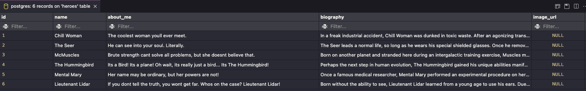
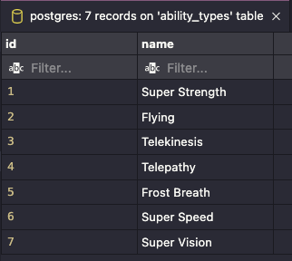
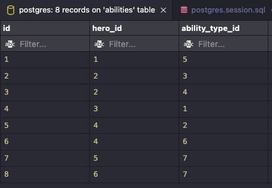
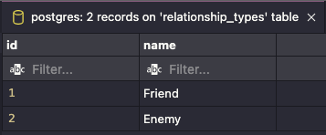
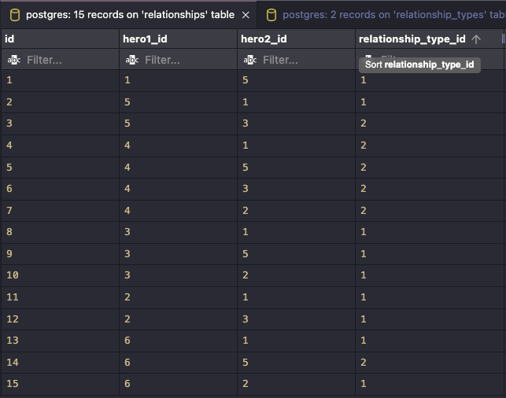

# **SQL Heroes**

## **Description**
Create an interactive shell script with python that helps superheroes stay in touch with their friends and keep track of super-villains through the terminal.

Create a connection to a database with PostgresQL and an interactive shell script that helps navigate the database.

Demo will be a demonstration of CRUD (Create/Read/Update/Delete) operations with an interactive python shell.

## **MVP**
App should perform CRUD operations on the supplied SQL Database file and prompt the uer for input in the terminal to show a list of heroes and their friends.
- At least one of each:
    - Create
    - Read
    - Update
    - Delete

## **Requirements**
Create a connection to a gitpod database using python 3 and view the database (using the vscode extension)
The supplied superheroes.sql database file contains CREATE TABLE and INSERT statements to get you started with seeded data. (DO NOT MODIFY THE SQL FILE DIRECTLY) Use the vscode extension to execute the file from top to bottom to get the appropriate tables/entries created.
Decide/Plan/Pseudocode on a minimum of four CRUD operations you with to implement (document these in README.md)
Interactive creation, update, delete of a hero in the terminal via python script, with commands that are available for the README.md.

## **Python Functions**

    def create_new_hero()

    def read_hero_profile()

    def update_hero_relationship()

    def delete_hero()
#
## **SQL Commands**

### **CREATE:** New hero
- When creating a new hero… input should be added to heroes, abilities and relationships tables
- One function that holds 3 INSERT’s (create…heroes, abilities, relationships)
- Terminal input calls function
- Function prints confirmation message

**Create Hero:**

    INSERT INTO
        heroes (name, about_me, biography)
    VALUES
        (
            ‘name’
            ‘about_me’
            ‘biography’
        );

**Create Ability:**

    INSERT INTO
        abilities (hero_id, ability_type_id)
    VALUES
        (#, #);

**Create Relationship:**

    INSERT INTO
        relationships (hero1_id, hero2_id, relationship_type_id)
    VALUES
        (#, #, #);

#
### **READ:** Hero Profile
- When reading hero profile…input queries heroes, abilities, relationships tables
- One function that holds 3 SELECT’s (query…heroes, abilities, relationships)

**Read Hero Profile:**

    SELECT
        name,
        about_me,
        biography
    FROM heroes
        JOIN 
            ON
        JOIN
            ON

#
### **UPDATE:** Relationship

**Update Relationship:**

    UPDATE
    SET
    WHERE
#
### **DELETE:** Hero

**Delete Hero:**

    DELETE FROM
    WHERE  
  
#  
# **heroes**

#
# **ability_types**

#
# **abilities**

# **relationship_types**

# **relationships**

