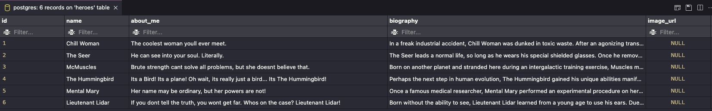
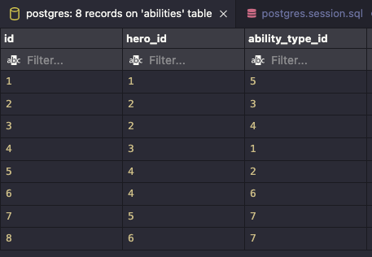
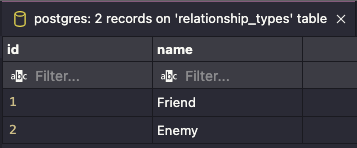

# **SQL Heroes**

## **Description**
Create an interactive shell script with python that helps superheroes stay in touch with their friends and keep track of super-villains through the terminal.

Create a connection to a database with PostgresQL and an interactive shell script that helps navigate the database.

Demo will be a demonstration of CRUD (Create/Read/Update/Delete) operations with an interactive python shell.

## **MVP**
App should perform CRUD operations on the supplied SQL Database file and prompt the uer for input in the terminal to show a list of heroes and their friends.
- At least one of each:
    - Create
    - Read
    - Update
    - Delete

## **Requirements**
- Create a connection to a gitpod database using python 3 and view the database (using the vscode extension)

- The supplied superheroes.sql database file contains CREATE TABLE and INSERT statements to get you started with seeded data. (DO NOT MODIFY THE SQL FILE DIRECTLY) Use the vscode extension to execute the file from top to bottom to get the appropriate tables/entries created.  

- Decide/Plan/Pseudocode on a minimum of four CRUD operations you with to implement (document these in README.md). 

- Interactive creation, update, delete of a hero in the terminal via python script, with commands that are available for the README.md.

#
## **SQL Commands**

### **CREATE:** New hero
- When creating a new hero… input should be added to heroes table
- Terminal input calls function
- Function prints confirmation message (updated list)

**Create Hero:**

    INSERT INTO
        heroes (name, about_me, biography)
    VALUES
        (
            ‘name’
            ‘about_me’
            ‘biography’
        );

#
### **READ:** Hero Profile

**Read Hero Profile:**

    SELECT
        name,
        about_me,
        biography
    FROM heroes

#
### **UPDATE:** Hero Name

**Update Hero Name:**

    UPDATE
    SET
    WHERE

#
### **DELETE:** Hero

**Delete Hero:**

    DELETE name FROM heroes
    WHERE

#
## **Python Functions**

**Main Menu**

    def input_start_menu()
        #calls load_start_menu()

    def load_start_menu()
        #lists CRUD options

**Create New Hero**

    def input_hero_profile()
        #input calls create_new_hero

    def create_new_hero()
        #SQL command to create hero
    

**Read Hero Profile**

    def input_hero_profile()
        #input calls read_hero_profile

    def read_hero_profile()
        #SQL command to query profile
    

**Update Hero Name**

    def input_hero_name()
        #input calls update_hero_name()

    def update_hero_name()
        #SQL command to update name
    

**Delete Hero**

    def input_delete_hero()
        #input calls delete_hero()

    def delete_hero()
        #SQL command to delete hero

#
# **PROCEDURE**
### **(create_new_hero)**

    DISPLAY
        “Press Enter to Begin…”
    INPUT 
    User presses enter/return

    DISPLAY
    1. Create New Hero
    2. Get Hero Profile
    3. Update Hero Ability
    4. Delete Hero

        “Choose a Selection…”
        “(Type Number then Press Enter)”

    INPUT
        User enters 1

    DISPLAY
        “Create your new hero's name:”
        “(Type name then Press Enter)”

    INPUT
        User types "Super Guy"
        User presses enter
    
     DISPLAY
        “Create your new hero's about me:”
        “(Type an about me in a single sentence then Press Enter)”
    
    INPUT
        User types "He used to be just a guy...until he became super"
        User presses enter
    
     DISPLAY
        “Create your new hero's biography:”
        “(Type a short biography in a few sentences then Press Enter)”
    
    INPUT
        User types "One day Guy woke up and felt super. So Guy went out into the world and did super things. From that day forward, Guy was no longer just Guy...he became Super Guy."
        User presses enter
    
    DISPLAY
        “You've just created a new hero!”
        1. Super Guy
        2. He used to be just a guy...until he became Super Guy
        3. One day Guy woke up and felt super. So Guy went out into the world and did super things. From that day forward, Guy was no longer just Guy...he became Super Guy.

        “Press Enter to Return to Main Menu”

#        
### **(read_hero_profile)**

    DISPLAY
        “Press Enter to Begin…”
    INPUT 
    User presses enter/return

    DISPLAY
        1. Create New Hero
        2. Get Hero Profile 
        3. Update Hero Ability
        4. Delete Hero

        “Choose a Selection…”
        “(Type Number then Press Enter)”

    INPUT
        User enters 2

    DISPLAY
        1. Chill Woman
        2. The Seer
        3. McMuscles
        4. The Hummingbird
        5. Mental Mary

        “Which Hero’s Profile would you like to see?”
        “(Type Number then Press Enter)”

    INPUT
        User enters 1

    DISPLAY
        - Chill Woman
        - The coolest woman you’ll ever meet.
        - In a freak industrial accident, Chill Woman was dunked in toxic waste. After an agonizing transformation, - she developed the ability to exhale sub-zero mist that freezes everything it touches.

        “Press Enter to Return to Main Menu”
    
    INPUT
        User presses enter

    DISPLAY main menu

### **(update_hero_name)**

    DISPLAY
        “Press Enter to Begin…”
    INPUT 
    User presses enter/return

    DISPLAY
    1. Create New Hero
    2. Get Hero Profile
    3. Update Hero Name
    4. Delete Hero

        “Choose a Selection…”
        “(Type Number then Press Enter)”

    INPUT
        User enters 3

    DISPLAY
        1. Chill Woman
        2. The Seer
        3. McMuscles
        4. The Hummingbird
        5. Mental Mary

        “Which hero's name would you like to change?”
        “(Type Number then Press Enter)”

    INPUT
        User enters 1
    
    DISPLAY
            "What is your hero's new name?"

    INPUT
        User enters "New Name"

    DISPLAY
        1. New Name
        2. The Seer
        3. McMuscles
        4. The Hummingbird
        5. Mental Mary

        “Press Enter to Return to Main Menu”

### **(delete_hero)**

    DISPLAY
        “Press Enter to Begin…”
    INPUT 
    User presses enter/return

    DISPLAY
    1. Create New Hero
    2. Get Hero Profile
    3. Update Hero Ability
    4. Delete Hero

        “Choose a Selection…”
        “(Type Number then Press Enter)”

    INPUT
        User enters 4

    DISPLAY
        1. Chill Woman
        2. The Seer
        3. McMuscles
        4. The Hummingbird
        5. Mental Mary

        “Which Hero’s would you like to delete?”
        “(Type Number then Press Enter)”

    INPUT
        User enters 1

    DISPLAY
        "Chill Woman has been deleted"
        "Here is the updated list of heroes."
        1. The Seer
        2. McMuscles
        3. The Hummingbird
        4. Mental Mary

        “Press Enter to Return to Main Menu”
  
#  
# **heroes**

# **ability_types**

# **abilities**

# **relationship_types**

# **relationships**

